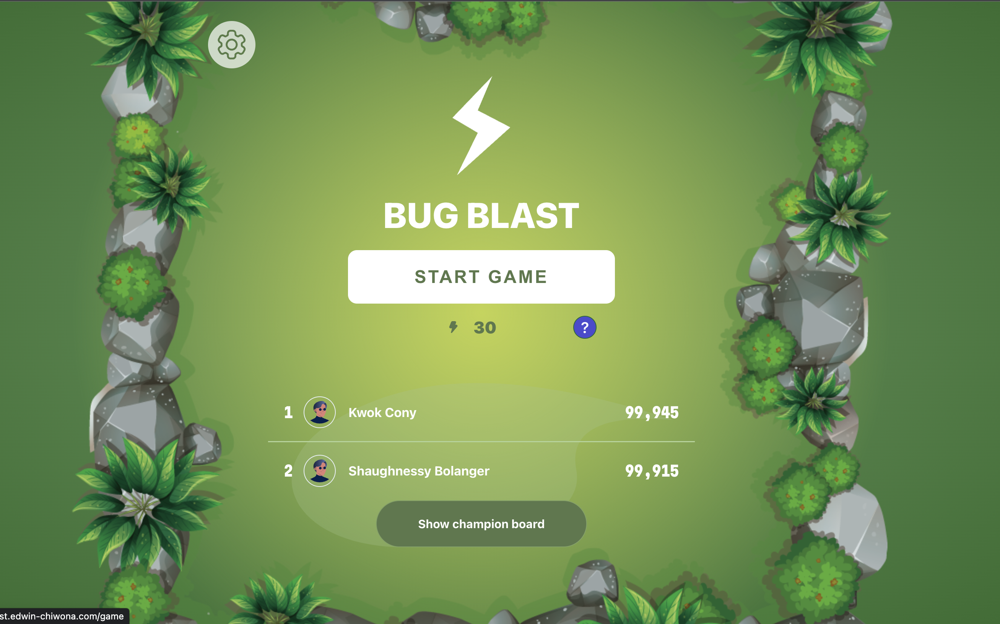
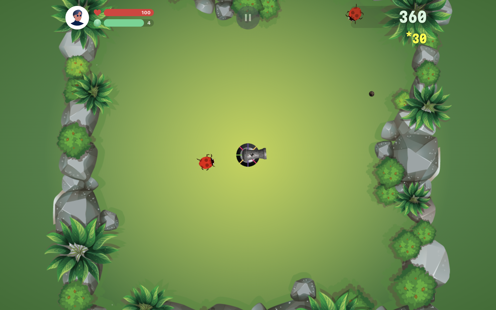

# Edwin Chiwona - Senior Engineer
[https://www.edwin-chiwona.com](https://www.edwin-chiwona.com)
## Overview
Welcome to my GitHub repository! I'm a seasoned Senior Engineer with a passion for full-stack development and a track record of delivering high-quality SaaS applications. With over seven years of experience, I've honed my skills in various technologies, including React, Redux, Node, Three.js, MySQL, Tailwind, PHP, and AWS.

## Projects
Here are some highlights of my recent projects:

### [Bug blast](https://bug-blast.edwin-chiwona.com/)
- Bug Blast" is a game where the player controls a cannon at the screen's center. The goal is to use the cannon to fire mortars and kill bugs that appear on the screen
- Technologies used: React, Redux, Node, HTML, Phaser.Js.
- To test game click [here](https://bug-blast.edwin-chiwona.com/) / Source Code [here](https://github.com/edwindijas/epic-battle)

### TaskSpace [WIP]
- Welcome to Taskspce where task management meets simplicity. Our intuitive platform streamlines your tasks list, fostering efficient organization and collaboration. Set deadlines, customize workflows, and enjoy a user-friendly interface designed for individuals and teams alike. Elevate your productivity with Taskspace, prioritizing security to ensure your data remains safeguarded.
- Technologies used: React, HTML, Tailwind, Typescript
- [View source code](https://github.com/edwindijas/todo) | [Check live demo](https://taskspace.edwin-chiwona.com/).

## Work Experience
I've had the privilege of contributing to notable projects during my career. Here are a few key roles:

### Proxify Ab, Sweden
#### Lead Engineer - Client: FreshFx Media (June 2023 - Present)
- Led the development of Football Philosophy Pages within Red Bull Aphub.
- Integrated 3D illustrations for enhanced engagement.
- Successfully delivered the entire Philosophy Pages section.

### Vonaffensels, Germany
#### Senior Frontend Engineer - Client: Vonaffensels (Jan 2023 – March 2023)
- Collaborated with the content strategy team, utilizing Storybook for component development.
- Successfully delivered key components, including a custom slideshow and event registration pages.

### Andela, USA
#### Senior Frontend Engineer - Client: ON24 (Dec 2021 – Dec 2022)
- Led the development of webinars, virtual events, and personalized content experiences.
- Engineered a comprehensive ticketing system for physical engagements.

## Skills
- React, JavaScript, TypeScript, NodeJS, Express-JS
- PHP, Jira, C#, ASP.NET, MySQL
- Tailwind, Styled Components, Jenkins, Redux
- SDLC, CI/CD, Linux Networking, Linux
- WCAG 2, PhaserJs, Pixi.js, Three-JS
- Graphic Design (Figma / Adobe XD / Adobe Illustrator)

## Contact
Feel free to reach out to me through [LinkedIn](https://www.linkedin.com/in/edwin-chiwona) for collaboration or inquiries.

Thank you for visiting my GitHub repository! 🚀
